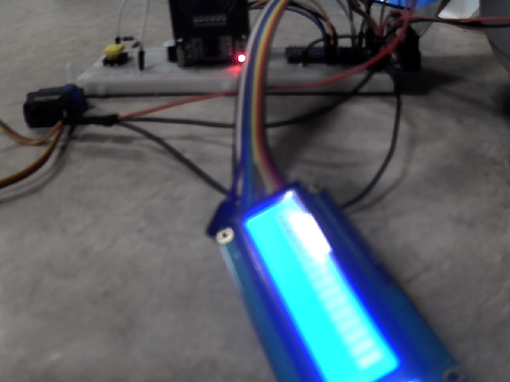

# Lab 7
## Information
Olivier Rogers: A16069362  
Moises Lopez: A14156109

## Challenge: Number Plate Detector
[Video Demonstration](https://youtu.be/q9RuNE5BRkY)
### Approach to finding the area of interest
1. Blur the image to remove high frequencies
2. Pass the image though a canny edge detected
3. Find the contour and sort them by contour area
4. drop everything but the biggest 25 contours.
5. Do polygon approximation for each contour
6. Ignored approximated polygons that are not 4 sided.
4. Pick the first 4 sided poligon, since that is the biggest rectangle in the image.

## Tutorial 1: Say Cheese!
In this tutorial we learned to install opencv2 onto the raspberry pi. And learned how to capture a image from a webcam in python.  

## Tutorial 2: Sudoku Extractor  
Tesseract and PyTesseract were installed for OCR. PyTesseract was used with OpenCV to extract a sudoku puzzle from an image.  
The default settings did not result in any extracted values. Some things learned:  
- Tesseract does not work very well with single characters. Strings are better.
- Changing the `psm` parameter to 10 instead of 11 improved the single character recognition.
- The current version prefers black text on white backgrounds.
- The best results for this example were obtained on an image with minimal blurring, with threshold applied, and with a little bit of padding on each cropped segment.
- We tried removing the borders (from the Sudoku grid), but that resulted in worse number detection.

